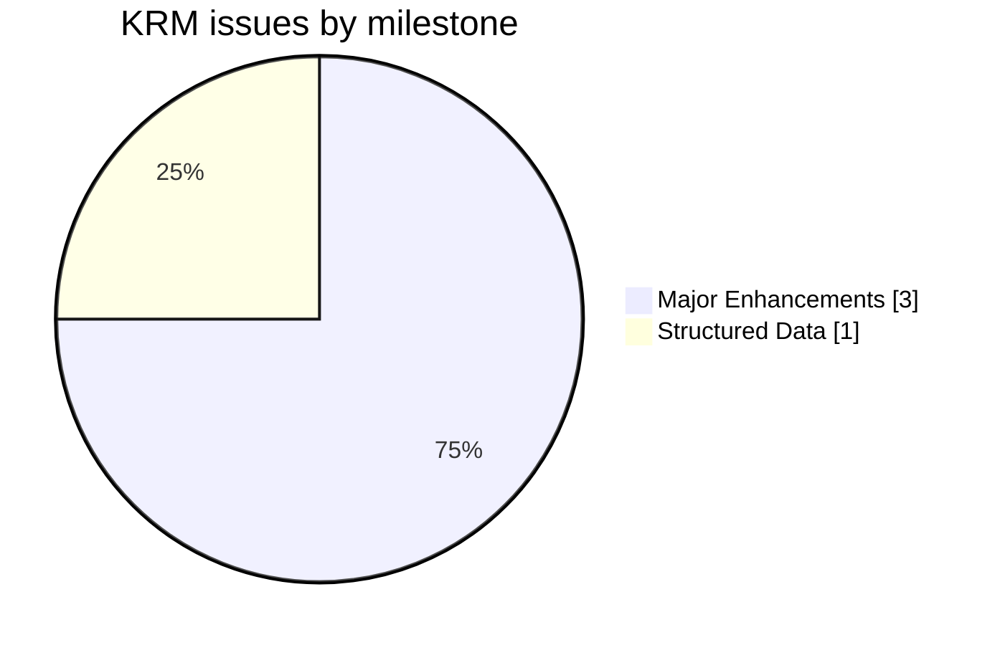
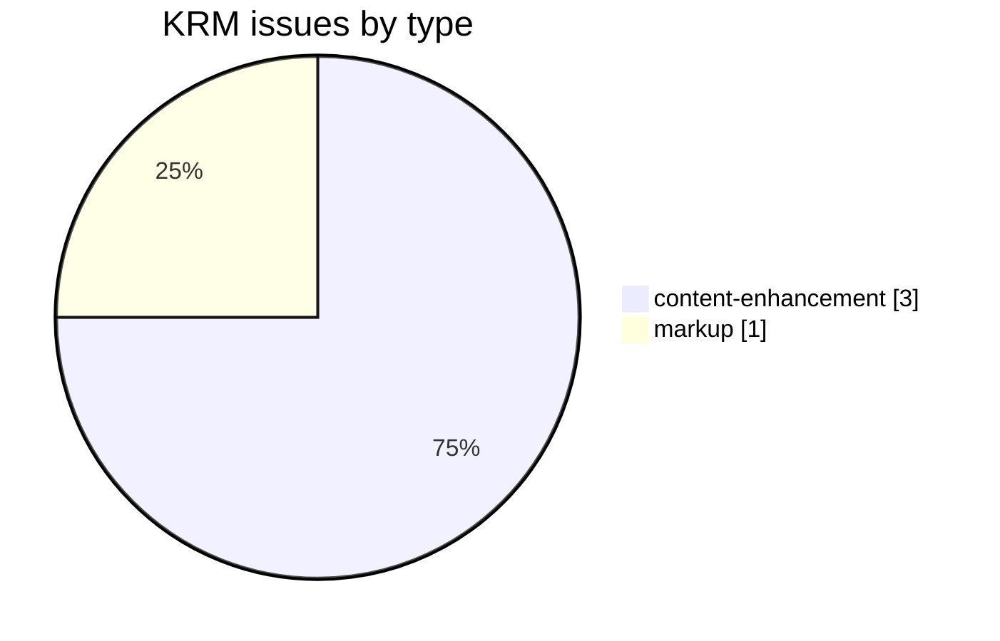
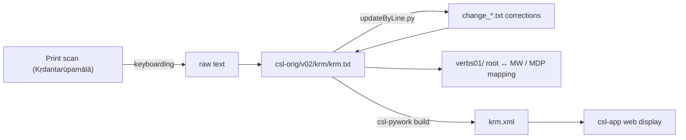

# KRM — *Kṛdantarūpamālā*

_Created: 31-03-2020 · Last updated: 05-07-2026_

Development and correction repository for the **_Kṛdantarūpamālā_** (attributed to Bhaṭṭoji Dīkṣita), a Sanskrit grammatical handbook of *kṛdanta* (primary derivative / participial) verb forms, part of the [Cologne Digital Sanskrit Lexicon](https://www.sanskrit-lexicon.uni-koeln.de/) (CDSL). The canonical source text lives in [`csl-orig/v02/krm/krm.txt`](https://github.com/sanskrit-lexicon/csl-orig/blob/master/v02/krm/krm.txt) (2,061 entries); this repository holds verb-identification and correction work.

## Documentation

- [CLAUDE.md](CLAUDE.md) — repository guide, correction workflow, and data-format reference.
- [DATA_DICTIONARY.md](DATA_DICTIONARY.md) — markup tag reference.
- [CONTRIBUTING.md](CONTRIBUTING.md) · [CODE_OF_CONDUCT.md](CODE_OF_CONDUCT.md) · [LICENSE](LICENSE)

## Contents

| Path | Purpose |
|---|---|
| `verbs01/` | Verb-identification: maps KRM roots to MW / Mādhavīya-Dhātuvṛtti headwords |
| `prefaces/` | Front-matter OCR (title pages, prefaces, forewords, author portrait) of all five volumes, with Russian translations — see [Front matter](#front-matter-prefaces) below |
| `CITATION.cff` | Machine-readable citation metadata |
| `DATA_DICTIONARY.md` | Markup tag reference |

## Timeline

| Period | Activity |
|---|---|
| 2020-03 – 2020-04 | Repository initialized; verb-identification work |
| 2026-05 | Issue taxonomy, citation metadata, documentation |
| 2026-06 | Front-matter OCR + Russian translation of the prefaces (`prefaces/`) |

## Projects & Milestones

| Milestone | Open | Closed | Total |
|---|---|---|---|
| Dictionary to Book | 0 | 0 | 0 |
| Digitization Quality | 0 | 0 | 0 |
| Structured Data | 0 | 1 | 1 |
| Major Enhancements | 3 | 0 | 3 |
| **Total** | **3** | **1** | **4** |



## Issues



### Open

| # | Title | Type | Severity | Milestone |
|---|---|---|---|---|
| 1 | KRM-MW | content-enhancement | medium | Major Enhancements |
| 2 | MDP-MW | content-enhancement | medium | Major Enhancements |
| 3 | krm-mdp-mw | content-enhancement | medium | Major Enhancements |

### Solved

| # | Title | Type | Severity | Milestone |
|---|---|---|---|---|
| 4 | [markup] Minor krm.txt Markup Oddities | markup | minor | Structured Data |

## Labels

### Type labels
| Label | Meaning |
|---|---|
| `link-target` | Click-throughs from `<ls>` abbreviations to scanned PDF pages |
| `link-splitting` | Splitting combined `SOURCE N,N` refs into per-page links |
| `markup` | Normalising XML tag content |
| `text-correction` | Corrections to Sanskrit text or headwords |
| `content-enhancement` | New material or structural additions beyond correction |
| `encoding` | SLP1/IAST transcoding, character normalisation |
| `scan-quality` | Replacing blurry/skewed/missing scan pages |
| `bug` | Broken links, XML errors, broken downloads |
| `question` | Scholarly questions requiring research |

### Severity labels
| Label | Meaning |
|---|---|
| `minor` | Targeted fix — a handful of lines or a single file |
| `medium` | Standard unit of work — one batch of corrections |
| `hard` | Large effort spanning many sources or files |

## Contributors

| Contributor | Commits |
|---|---|
| Mārcis Gasūns | 8 |
| funderburkjim | 4 |

## Source

- **Author**: attributed to Bhaṭṭoji Dīkṣita
- **Title**: *Kṛdantarūpamālā* (a handbook of *kṛdanta* verb-derivative forms)
- **Year (edition digitized)**: 1965
- **Language**: Sanskrit → Sanskrit (grammatical)
- **Scope**: verb / *kṛdanta* forms only
- **Entries (digital edition)**: 2,061
- See [CITATION.cff](CITATION.cff) for machine-readable citation. The repository `LICENSE` and `CITATION.cff` both declare CC BY-SA 4.0.

## Encoding

- UTF-8 (NFC) throughout.
- Sanskrit text in SLP1 transliteration, inside `<s>…</s>` and `{@…@}`/`` display markup.
- Devanāgarī and IAST are generated at display time, not stored in the source.

## Usage example

Applying a correction to the real first entry of [`krm.txt`](https://github.com/sanskrit-lexicon/csl-orig/blob/master/v02/krm/krm.txt) with `updateByLine.py` (see root [`CLAUDE.md`](https://github.com/sanskrit-lexicon/csl-orig/blob/master/CLAUDE.md) "Shared correction pattern"). The real current line 8 reads:

```
<HI>(1) <s>jaganmAtA parA SaktirBajatAmizwadAyinI .</s>
```

A change file pairs the old line with its replacement (here illustrating a hypothetical typo fix, `Sakti` → `SaktiH`, addressed by line number):

```
; change_krm_example.txt
8 old <HI>(1) <s>jaganmAtA parA SaktirBajatAmizwadAyinI .</s>
8 new <HI>(1) <s>jaganmAtA parA SaktiHrBajatAmizwadAyinI .</s>
```

```sh
python updateByLine.py krm.txt change_krm_example.txt krm_corrected.txt
```

This is illustrative only (no such correction is queued) — it shows the real pre-existing line 8 as the "before" state and the exact invocation used against `csl-orig/v02/krm/krm.txt`.

## How it works



## Front matter (`prefaces/`)

The [`prefaces/`](prefaces/) folder holds an OCR of the **front matter** of the *Kṛdantarūpamālā* across all **five volumes** (1965–1971) — title pages, general prefaces, prefaces, forewords, and the author's portrait page — published by the Samskrit Education Society, Madras. The work was begun by *Śāstraratnākara, Kulapati* Pt. **S. Ramasubba Sastri** and completed after his death by his pupils **V. Srivatsankacharya** and **T. K. Pranatartiharan**, under the supervision of Dr. **V. Raghavan**.

- **Source scans** (CDSL csldoc): `https://sanskrit-lexicon.uni-koeln.de/scans/csldev/csldoc/build/dictionaries/prefaces/krmpref.html`
- **Source language: English** (two Sanskrit pages — the vol. 1 Sanskrit title and the vol. 5 author-portrait caption/verse — kept verbatim in Devanāgarī). Because the source is English, there is no separate `.en` edition; the base `.md` is the English. Each page also has a Russian translation (`.ru.md`).
- **24 pages**, all present (all 24 scans on disk; no pages pending).
- **Consolidated editions:** [`krmpref_all.en.md`](prefaces/krmpref_all.en.md) (source) · [`krmpref_all.ru.md`](prefaces/krmpref_all.ru.md) (Russian), built reproducibly by [`build_combined.py`](prefaces/build_combined.py).
- **In-folder index:** [`prefaces/README.md`](prefaces/README.md).
- **Signatures/dates:** C. P. Ramaswami Aiyar, V. Raghavan, K. Balasubrahmania Iyer (1967, 1968), N. Raghunathan (1971); volume imprints 1965 / 1966 / 1967 / 1968 / 1971.
- Digitizer running header/footer stamps and library stamps (e.g. Bonn) were omitted as not part of the original.

<details>
<summary><strong>OCR run notes (2026-06-23)</strong> — cost, timing, and technical lessons</summary>

Produced by the `/cologne-preface-ocr` skill (vision OCR + translation). Process retrospective, not part of the deliverable.

**Context.** Resumed a half-finished job: 24 scans already on disk and pages 01–17 base `.md` already OCR'd by a prior run; no `.ru.md` and no consolidated files existed. The Cologne scan server was down, so this run worked **disk-only** — no downloads.

**Work done this run.** OCR'd the remaining 7 base pages (18–24) from native-resolution crops (≤1900 px bands of the 1892×2834 scans, ≤5 crops/page); wrote Russian translations for **all 24** pages; built the consolidated `*_all.*` editions; wrote the in-folder and root-README indexes.

**Cost (estimate).** Synchronous main-thread run, no subagents. ≈30–35 native-resolution crop reads (7 OCR pages × 3 bands + Devanāgarī tiles) plus 48 page-file writes and 2 combined builds. **Total ≈0.45–0.55 M tokens.**

**Time.** Wall-clock ≈15 min, gated by the per-page crop→read→write loop.

**Technical lessons (reusable):**
1. Source is **English**, not Sanskrit — only two pages (vol. 1 Sanskrit title, vol. 5 portrait caption/verse) are Devanāgarī. So `.en` is skipped and the source-base files are the English text; the consolidated source edition is tagged `.en`.
2. `build_combined.py`'s page glob `krmpref[0-9][0-9].md` correctly matches the real `krmprefNN.md` filenames (no `krmNN.md` mismatch here) — verified before building.
3. A Sanskrit `# heading` quoted **inside** a page body (vol. 1 Sanskrit title in `krmpref02.ru.md`) became a stray top-level `##` after the builder's heading-demotion, inflating the H2 count to 26. Fixed by demoting that inner heading to `##` in the source so it lands at `###`. H2 count is now exactly 25 (1 TOC + 24 pages) in both editions.
4. The portrait page (24) needed a separate 3× Devanāgarī crop of the caption and benedictory verse to read the conjuncts reliably.

</details>

---
*Issue taxonomy and documentation per the [Cologne issue runbook](https://github.com/sanskrit-lexicon/csl-observatory/blob/main/runbook/cologne-issue-runbook.md).*

_Dr. Mārcis Gasūns_
