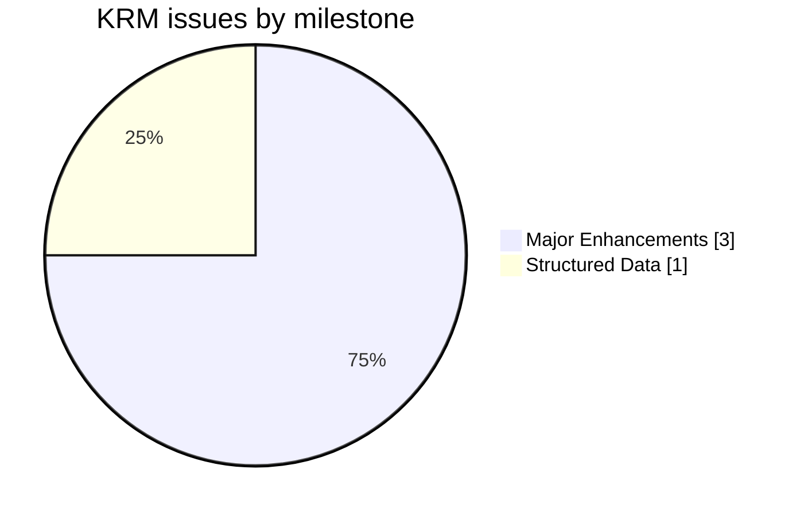
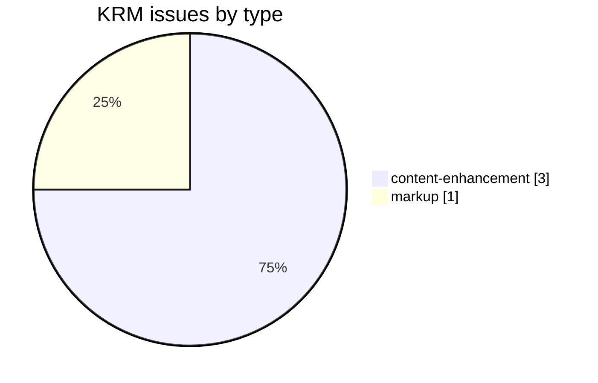
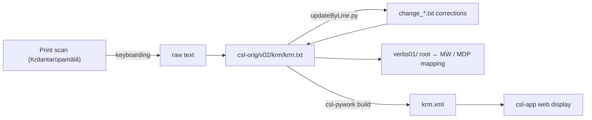

# KRM — *Kṛdantarūpamālā*

Development and correction repository for the **_Kṛdantarūpamālā_** (attributed to Bhaṭṭoji Dīkṣita), a Sanskrit grammatical handbook of *kṛdanta* (primary derivative / participial) verb forms, part of the [Cologne Digital Sanskrit Lexicon](https://www.sanskrit-lexicon.uni-koeln.de/) (CDSL). The canonical source text lives in [`csl-orig/v02/krm/krm.txt`](https://github.com/sanskrit-lexicon/csl-orig/blob/master/v02/krm/krm.txt) (2,061 entries); this repository holds verb-identification and correction work.

## Documentation

- [CLAUDE.md](CLAUDE.md) — repository guide, correction workflow, and data-format reference.
- [DATA_DICTIONARY.md](DATA_DICTIONARY.md) — markup tag reference.
- [CONTRIBUTING.md](CONTRIBUTING.md) · [CODE_OF_CONDUCT.md](CODE_OF_CONDUCT.md) · [LICENSE](LICENSE)

## Contents

| Path | Purpose |
|---|---|
| `verbs01/` | Verb-identification: maps KRM roots to MW / Mādhavīya-Dhātuvṛtti headwords |
| `CITATION.cff` | Machine-readable citation metadata |
| `DATA_DICTIONARY.md` | Markup tag reference |

## Timeline

| Period | Activity |
|---|---|
| 2020-03 – 2020-04 | Repository initialized; verb-identification work |
| 2026-05 | Issue taxonomy, citation metadata, documentation |

## Projects & Milestones

| Milestone | Open | Closed | Total |
|---|---|---|---|
| Dictionary to Book | 0 | 0 | 0 |
| Digitization Quality | 0 | 0 | 0 |
| Structured Data | 0 | 1 | 1 |
| Major Enhancements | 3 | 0 | 3 |
| **Total** | **3** | **1** | **4** |

## Issues

### Open

| # | Title | Type | Severity | Milestone |
|---|---|---|---|---|
| 1 | KRM-MW | content-enhancement | medium | Major Enhancements |
| 2 | MDP-MW | content-enhancement | medium | Major Enhancements |
| 3 | krm-mdp-mw | content-enhancement | medium | Major Enhancements |

### Solved

| # | Title | Type | Severity | Milestone |
|---|---|---|---|---|
| 4 | [markup] Minor krm.txt Markup Oddities | markup | minor | Structured Data |

## Labels

### Type labels
| Label | Meaning |
|---|---|
| `link-target` | Click-throughs from `<ls>` abbreviations to scanned PDF pages |
| `link-splitting` | Splitting combined `SOURCE N,N` refs into per-page links |
| `markup` | Normalising XML tag content |
| `text-correction` | Corrections to Sanskrit text or headwords |
| `content-enhancement` | New material or structural additions beyond correction |
| `encoding` | SLP1/IAST transcoding, character normalisation |
| `scan-quality` | Replacing blurry/skewed/missing scan pages |
| `bug` | Broken links, XML errors, broken downloads |
| `question` | Scholarly questions requiring research |

### Severity labels
| Label | Meaning |
|---|---|
| `minor` | Targeted fix — a handful of lines or a single file |
| `medium` | Standard unit of work — one batch of corrections |
| `hard` | Large effort spanning many sources or files |

## Contributors

| Contributor | Commits |
|---|---|
| Mārcis Gasūns | 8 |
| funderburkjim | 4 |

## Source

- **Author**: attributed to Bhaṭṭoji Dīkṣita
- **Title**: *Kṛdantarūpamālā* (a handbook of *kṛdanta* verb-derivative forms)
- **Year (edition digitized)**: 1965
- **Language**: Sanskrit → Sanskrit (grammatical)
- **Scope**: verb / *kṛdanta* forms only
- **Entries (digital edition)**: 2,061
- See [CITATION.cff](CITATION.cff) for machine-readable citation. **Note:** the repository `LICENSE` is GPL-3.0 while `CITATION.cff` declares CC BY-SA 4.0 — see CLAUDE.md.

## Encoding

- UTF-8 (NFC) throughout.
- Sanskrit text in SLP1 transliteration, inside `<s>…</s>` and `{@…@}`/`` display markup.
- Devanāgarī and IAST are generated at display time, not stored in the source.

## How it works

---
*Issue taxonomy and documentation per the [Cologne issue runbook](https://github.com/sanskrit-lexicon/csl-observatory/blob/main/runbook/cologne-issue-runbook.md).*
